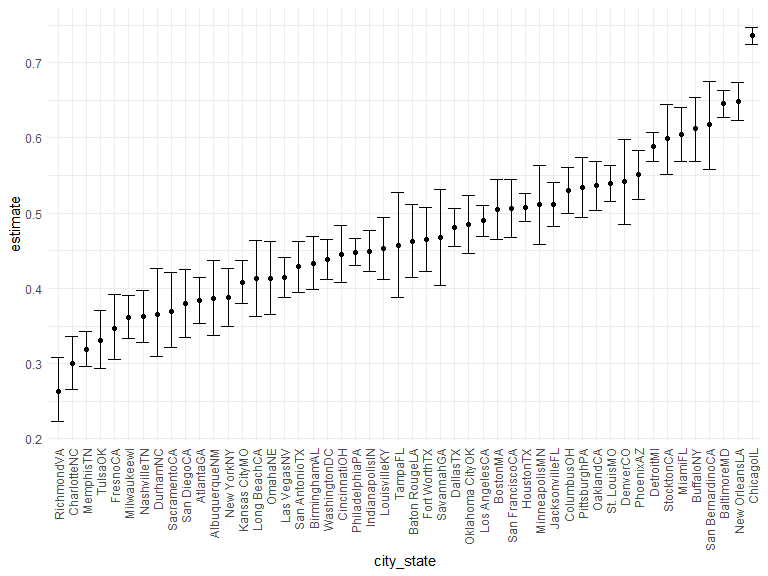

Homework 5
================
Hao Xu
11/20/2021

``` r
library(tidyverse)
```

    ## -- Attaching packages --------------------------------------- tidyverse 1.3.1 --

    ## v ggplot2 3.3.5     v purrr   0.3.4
    ## v tibble  3.1.5     v dplyr   1.0.7
    ## v tidyr   1.1.4     v stringr 1.4.0
    ## v readr   2.0.2     v forcats 0.5.1

    ## -- Conflicts ------------------------------------------ tidyverse_conflicts() --
    ## x dplyr::filter() masks stats::filter()
    ## x dplyr::lag()    masks stats::lag()

``` r
library(p8105.datasets)
library(viridis)
```

    ## Loading required package: viridisLite

``` r
library(readr)

knitr::opts_chunk$set(
  echo = TRUE,
  warning = FALSE,
  fig.width = 8,
  fig.height = 6,
  out.width = "90%"
)

options(
  ggplot2.continuous.colour = "viridis",
  ggplot2.continuous.fill = "viridis"
)

scale_colour_discrete = scale_colour_viridis_d
scale_fill_discrete = scale_fill_viridis_d

theme_set(theme_minimal() + theme(legend.position = "bottom"))
```

# Problem 1

For this problem, we are interested in data gathered and made public by
*The Washington Post* on homicides in 50 large U.S. cities. The code
chunk below imports and cleans the data.

``` r
homicide_df = 
  read_csv("./files/homicide-data.csv", na = c("", "Unknown")) %>% 
  mutate(
    city_state = str_c(city, state),
    resolution = case_when(
      disposition == "Closed without arrest" ~ "unsolved",
      disposition == "Open/No arrest"        ~ "unsolved",
      disposition == "Closed by arrest"      ~ "solved",
    )
  ) %>% 
  relocate(city_state) %>% 
  filter(city_state != "TulsaAL")
```

    ## Rows: 52179 Columns: 12

    ## -- Column specification --------------------------------------------------------
    ## Delimiter: ","
    ## chr (8): uid, victim_last, victim_first, victim_race, victim_sex, city, stat...
    ## dbl (4): reported_date, victim_age, lat, lon

    ## 
    ## i Use `spec()` to retrieve the full column specification for this data.
    ## i Specify the column types or set `show_col_types = FALSE` to quiet this message.

Now focus on Baltimore, MD.

``` r
baltimore_df = 
  homicide_df %>% 
  filter(city_state == "BaltimoreMD")

baltimore_summary = 
  baltimore_df %>% 
  summarise(
    unsolved = sum(resolution == "unsolved"),
    n = n()
  )

baltimore_test = 
  prop.test(
  x = baltimore_summary %>% pull(unsolved),
  n = baltimore_summary %>% pull(n)
)

baltimore_test %>% 
  broom::tidy()
```

    ## # A tibble: 1 x 8
    ##   estimate statistic  p.value parameter conf.low conf.high method    alternative
    ##      <dbl>     <dbl>    <dbl>     <int>    <dbl>     <dbl> <chr>     <chr>      
    ## 1    0.646      239. 6.46e-54         1    0.628     0.663 1-sample~ two.sided

Write a function to test other cities.

``` r
prop_test_function = function(city_df){
  
  city_summary = 
    city_df %>% 
    summarise(
      unsolved = sum(resolution == "unsolved"),
      n = n()
    )
  
  city_test = 
    prop.test(
      x = city_summary %>% pull(unsolved),
      n = city_summary %>% pull(n)
    )
}
```

Iterate across cities

``` r
results_df = 
  homicide_df %>% 
  nest(data = uid:resolution) %>% 
  mutate(
    test_results = map(data, prop_test_function),
    tidy_results = map(test_results, broom::tidy)
  ) %>% 
  select(city_state, tidy_results) %>% 
  unnest(tidy_results) %>% 
  select(city_state, estimate, starts_with("conf"))

knitr::kable(results_df)
```

| city_state       |  estimate |  conf.low | conf.high |
|:-----------------|----------:|----------:|----------:|
| AlbuquerqueNM    | 0.3862434 | 0.3372604 | 0.4375766 |
| AtlantaGA        | 0.3833505 | 0.3528119 | 0.4148219 |
| BaltimoreMD      | 0.6455607 | 0.6275625 | 0.6631599 |
| Baton RougeLA    | 0.4622642 | 0.4141987 | 0.5110240 |
| BirminghamAL     | 0.4337500 | 0.3991889 | 0.4689557 |
| BostonMA         | 0.5048860 | 0.4646219 | 0.5450881 |
| BuffaloNY        | 0.6122841 | 0.5687990 | 0.6540879 |
| CharlotteNC      | 0.2998544 | 0.2660820 | 0.3358999 |
| ChicagoIL        | 0.7358627 | 0.7239959 | 0.7473998 |
| CincinnatiOH     | 0.4452450 | 0.4079606 | 0.4831439 |
| ColumbusOH       | 0.5304428 | 0.5002167 | 0.5604506 |
| DallasTX         | 0.4811742 | 0.4561942 | 0.5062475 |
| DenverCO         | 0.5416667 | 0.4846098 | 0.5976807 |
| DetroitMI        | 0.5883287 | 0.5687903 | 0.6075953 |
| DurhamNC         | 0.3659420 | 0.3095874 | 0.4260936 |
| Fort WorthTX     | 0.4644809 | 0.4222542 | 0.5072119 |
| FresnoCA         | 0.3470226 | 0.3051013 | 0.3913963 |
| HoustonTX        | 0.5074779 | 0.4892447 | 0.5256914 |
| IndianapolisIN   | 0.4493192 | 0.4223156 | 0.4766207 |
| JacksonvilleFL   | 0.5111301 | 0.4820460 | 0.5401402 |
| Kansas CityMO    | 0.4084034 | 0.3803996 | 0.4370054 |
| Las VegasNV      | 0.4141926 | 0.3881284 | 0.4407395 |
| Long BeachCA     | 0.4126984 | 0.3629026 | 0.4642973 |
| Los AngelesCA    | 0.4900310 | 0.4692208 | 0.5108754 |
| LouisvilleKY     | 0.4531250 | 0.4120609 | 0.4948235 |
| MemphisTN        | 0.3190225 | 0.2957047 | 0.3432691 |
| MiamiFL          | 0.6048387 | 0.5685783 | 0.6400015 |
| MilwaukeewI      | 0.3614350 | 0.3333172 | 0.3905194 |
| MinneapolisMN    | 0.5109290 | 0.4585150 | 0.5631099 |
| NashvilleTN      | 0.3624511 | 0.3285592 | 0.3977401 |
| New OrleansLA    | 0.6485356 | 0.6231048 | 0.6731615 |
| New YorkNY       | 0.3875598 | 0.3494421 | 0.4270755 |
| OaklandCA        | 0.5364308 | 0.5040588 | 0.5685037 |
| Oklahoma CityOK  | 0.4851190 | 0.4467861 | 0.5236245 |
| OmahaNE          | 0.4132029 | 0.3653146 | 0.4627477 |
| PhiladelphiaPA   | 0.4478103 | 0.4300380 | 0.4657157 |
| PhoenixAZ        | 0.5514223 | 0.5184825 | 0.5839244 |
| PittsburghPA     | 0.5340729 | 0.4942706 | 0.5734545 |
| RichmondVA       | 0.2634033 | 0.2228571 | 0.3082658 |
| San AntonioTX    | 0.4285714 | 0.3947772 | 0.4630331 |
| SacramentoCA     | 0.3696809 | 0.3211559 | 0.4209131 |
| SavannahGA       | 0.4674797 | 0.4041252 | 0.5318665 |
| San BernardinoCA | 0.6181818 | 0.5576628 | 0.6753422 |
| San DiegoCA      | 0.3796095 | 0.3354259 | 0.4258315 |
| San FranciscoCA  | 0.5067873 | 0.4680516 | 0.5454433 |
| St. LouisMO      | 0.5396541 | 0.5154369 | 0.5636879 |
| StocktonCA       | 0.5990991 | 0.5517145 | 0.6447418 |
| TampaFL          | 0.4567308 | 0.3881009 | 0.5269851 |
| TulsaOK          | 0.3310463 | 0.2932349 | 0.3711192 |
| WashingtonDC     | 0.4379182 | 0.4112495 | 0.4649455 |

Make the plot

``` r
results_df %>% 
  mutate(city_state = fct_reorder(city_state, estimate)) %>% 
  ggplot(aes(x = city_state, y = estimate)) +
  geom_point() +
  geom_errorbar(aes(ymin = conf.low, ymax = conf.high)) +
  theme(axis.text.x = element_text(angle = 90, vjust = 0.5, hjust = 1))
```



Finally get the number of unresolved and total, for each city.

``` r
homicide_df %>% 
  group_by(city_state) %>% 
  summarise(
    unsolved = sum(resolution == "unsolved"),
    n = n()
  ) %>% 
  knitr::kable()
```

| city_state       | unsolved |    n |
|:-----------------|---------:|-----:|
| AlbuquerqueNM    |      146 |  378 |
| AtlantaGA        |      373 |  973 |
| BaltimoreMD      |     1825 | 2827 |
| Baton RougeLA    |      196 |  424 |
| BirminghamAL     |      347 |  800 |
| BostonMA         |      310 |  614 |
| BuffaloNY        |      319 |  521 |
| CharlotteNC      |      206 |  687 |
| ChicagoIL        |     4073 | 5535 |
| CincinnatiOH     |      309 |  694 |
| ColumbusOH       |      575 | 1084 |
| DallasTX         |      754 | 1567 |
| DenverCO         |      169 |  312 |
| DetroitMI        |     1482 | 2519 |
| DurhamNC         |      101 |  276 |
| Fort WorthTX     |      255 |  549 |
| FresnoCA         |      169 |  487 |
| HoustonTX        |     1493 | 2942 |
| IndianapolisIN   |      594 | 1322 |
| JacksonvilleFL   |      597 | 1168 |
| Kansas CityMO    |      486 | 1190 |
| Las VegasNV      |      572 | 1381 |
| Long BeachCA     |      156 |  378 |
| Los AngelesCA    |     1106 | 2257 |
| LouisvilleKY     |      261 |  576 |
| MemphisTN        |      483 | 1514 |
| MiamiFL          |      450 |  744 |
| MilwaukeewI      |      403 | 1115 |
| MinneapolisMN    |      187 |  366 |
| NashvilleTN      |      278 |  767 |
| New OrleansLA    |      930 | 1434 |
| New YorkNY       |      243 |  627 |
| OaklandCA        |      508 |  947 |
| Oklahoma CityOK  |      326 |  672 |
| OmahaNE          |      169 |  409 |
| PhiladelphiaPA   |     1360 | 3037 |
| PhoenixAZ        |      504 |  914 |
| PittsburghPA     |      337 |  631 |
| RichmondVA       |      113 |  429 |
| SacramentoCA     |      139 |  376 |
| San AntonioTX    |      357 |  833 |
| San BernardinoCA |      170 |  275 |
| San DiegoCA      |      175 |  461 |
| San FranciscoCA  |      336 |  663 |
| SavannahGA       |      115 |  246 |
| St. LouisMO      |      905 | 1677 |
| StocktonCA       |      266 |  444 |
| TampaFL          |       95 |  208 |
| TulsaOK          |      193 |  583 |
| WashingtonDC     |      589 | 1345 |

# Problem 2

First get all the file names:

``` r
zipdata = tibble(
  files = list.files("./files/data/")
)
```

Use the map function to get the relative directory for each file

``` r
directory = map(.x = zipdata[[1]], ~str_c("./files/data/", .x)) %>% unlist()
```

Now get the data from each file, create variable indicating the arm and
id, and other cleaning process

``` r
complete_data = zipdata %>% 
  mutate(
    datas = map(.x = directory, ~read_csv(.x))
  ) %>% 
  unnest(datas) %>% 
  
  #separate the file variable to get subject ID
  separate(files, into = c("subject_id"), sep = 6) %>% 
  
  #get the arms, but still keep the subject_id
  separate(subject_id, into = "arm", sep = 3, remove = FALSE) %>% 
  
  #rename the variables in "arm"
  mutate(
    arm = fct_recode(arm, "control" = "con",
                          "experimental" = "exp")
  ) %>% 
  
  #use pivot_longer
  pivot_longer(week_1:week_8, names_to = "week_number", values_to = "observation") %>% 
  
  #remove the "week_" in each cell of the variable "week_number"
  mutate(week_number = str_replace(week_number, "week_", ""),
         week_number = as.numeric(week_number))
```

Now get the spaghetti plot

``` r
complete_data %>% 
  ggplot(aes(x = week_number, y = observation, color = arm)) +
  geom_line(aes(group = subject_id)) +
  labs(
    x = "Week Number",
    title = "spaghetti plot of observations for each subject"
  )
```


As we can see on the plot, the experimental group has generally larger
observation than the control group, and we could conclude that the thing
we are experimenting is effective.

# Problem 3

Get the data

``` r
set.seed(10)

iris_with_missing = iris %>% 
  map_df(~replace(.x, sample(1:150, 20), NA)) %>%
  mutate(Species = as.character(Species))
```

Now write the function

``` r
my_function = function(vec){
  if (is.numeric(vec)) {
    mean = mean(vec, na.rm = TRUE)
    vec = replace_na(vec, mean)
  }else if (is.character(vec)) {
    vec = replace_na(vec, "virginica")
  }
  vec
}
```

Now apply it to all the columns

``` r
iris_with_missing = iris_with_missing %>% 
  map(my_function) %>% 
  as.tibble()

iris_with_missing
```

    ## # A tibble: 150 x 5
    ##    Sepal.Length Sepal.Width Petal.Length Petal.Width Species
    ##           <dbl>       <dbl>        <dbl>       <dbl> <chr>  
    ##  1         5.1          3.5         1.4         0.2  setosa 
    ##  2         4.9          3           1.4         0.2  setosa 
    ##  3         4.7          3.2         1.3         0.2  setosa 
    ##  4         4.6          3.1         1.5         1.19 setosa 
    ##  5         5            3.6         1.4         0.2  setosa 
    ##  6         5.4          3.9         1.7         0.4  setosa 
    ##  7         5.82         3.4         1.4         0.3  setosa 
    ##  8         5            3.4         1.5         0.2  setosa 
    ##  9         4.4          2.9         1.4         0.2  setosa 
    ## 10         4.9          3.1         3.77        0.1  setosa 
    ## # ... with 140 more rows
